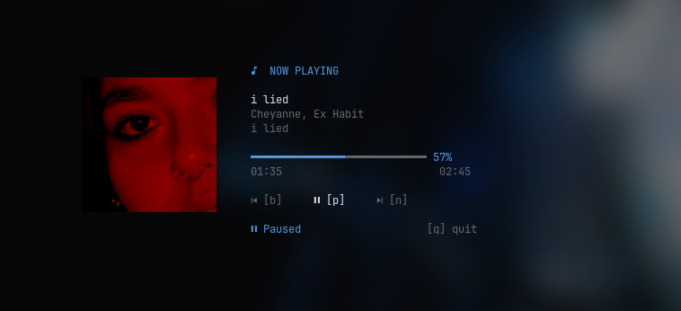

# playerctl-cli

A simple and lightweight terminal music controller for Linux, powered by [Playerctl](https://github.com/altdesktop/playerctl).

Control your currently playing media directly from the terminal with a simple `music` command.

## 🖥️ Example
here's the example or the preview for the cli:


## Requirements for the cli

* Linux
* git
* curl
* [Playerctl](https://github.com/altdesktop/playerctl)
* or if you don't have the package from your distro's repo:

```bash
git clone https://github.com/altdesktop/playerctl.git
cd playerctl
./autogen.sh
./configure
make
sudo make install
```

## 1. Installation with install script
1. Copy the code:

```bash
curl -fsSL https://raw.githubusercontent.com/moonelliaven/playerctl-cli/main/install.sh -o install.sh
chmod +x install.sh
./install.sh
```

2. try run the code:
```bash
music
```

## Manual Installation (if the curl command above doesn't work for you)
1. Clone the repository:

```bash
git clone https://github.com/moonelliaven/playerctl-cli.git
cd playerctl-cli
```

2. Make the script executable:

```bash
chmod +x music
```

3. Install it as a system-wide user command:

```bash
mkdir -p ~/.local/bin
cp music ~/.local/bin/music
```

4. Make sure `~/.local/bin` is in your `PATH`:

```bash
fish_add_path ~/.local/bin
```

5. Restart your terminal or reload your shell.

## Usage the script

Run:

```bash
music
```

## Troubleshooting
1. if the code doesn't work try run this command:

```bash
playerctl status
```

2. if the code still doesn't work, then you need to install playerctl:

> Note that not all media players support MPRIS, but most common ones do, such as Spotify, VLC, and MPD.


## Built With:

* **Bash** — CLI scripting
* **Playerctl** — Media player control via MPRIS
* **Linux** — Target platform
